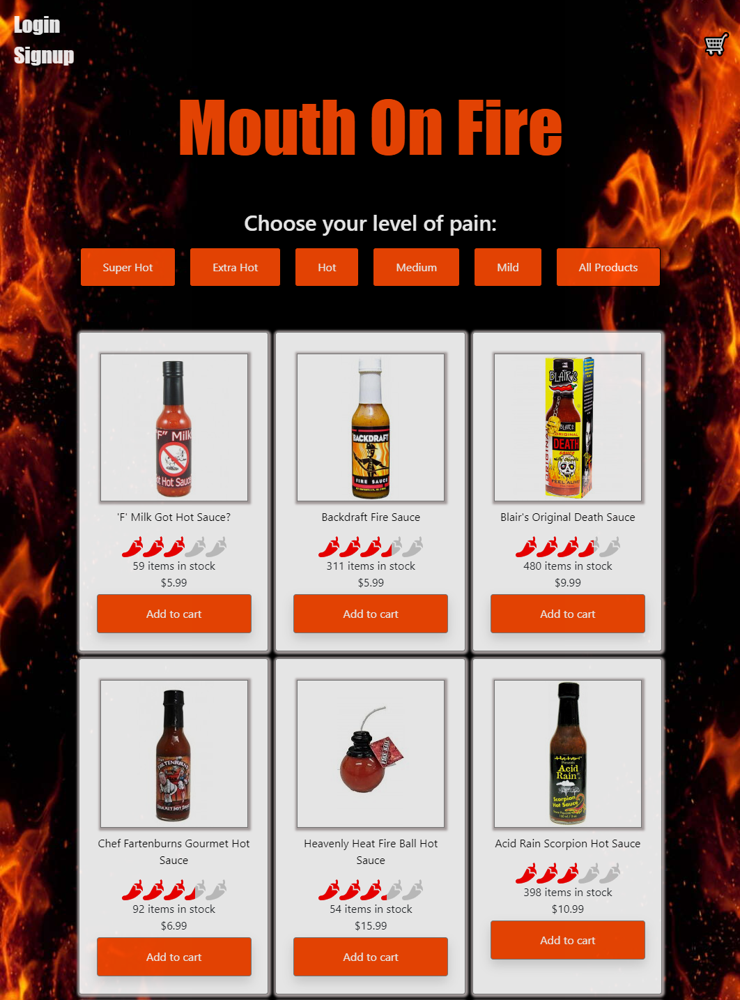
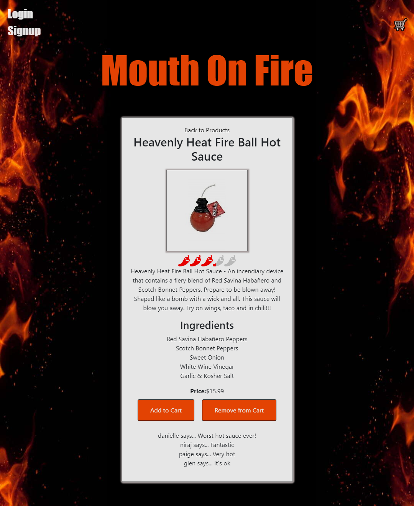
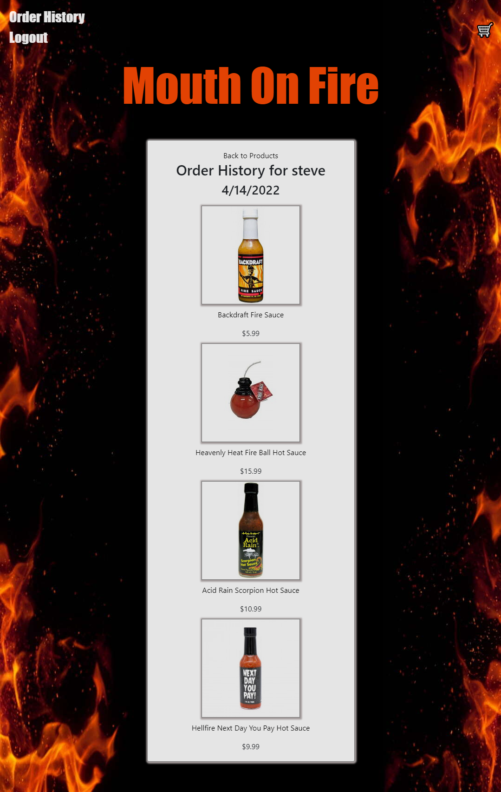

 </a>

<h3 align="center">Mouth On Fire</h3>

---

## 

- [About](#about)
- [Installing](#installing)
- [Usage](#usage)
- [Built With](#built_using)
- [Authors](#authors)
- [Questions](#questions)
- [Screenshots](#screenshots)

## 

- Mouth On Fire is an E-commerce website that sells hot sauce of varying heat index.

## 

- Deployed at Heroku: https://murmuring-temple-96516.herokuapp.com/

- When visiting Mouth On Fire you are presented with a homepage that displays all of the products and links to login or signup. Clicking on the links will take you to the respective pages where you can get logged in. Once logged in you will be redirected to the homepage. Products can be sorted by category by clicking the corresponding button. If a product is clicked you will be directed to the product detail page where you will get all the details for that product. Along with the details you will see a review form where you can write a review of the product. Clicking the add to cart button will add the product to the cart. Once you have added all the products you would like to buy to the cart simply click checkout to be directed to Stripe where you can finish your purchase. After completing your purchase with Stripe you will be presented with a success page then redirected to the homepage after a short pause. Clicking on order history will display all the products you have previously purchased. To logout of the website simply click logout.

## 

- MongoDB
- Mongoose
- GraphQL
- Express.js
- Node.js
- Bcrypt
- JWT
- Stripe
- React
- CSS
- Bootstrap
- JavaScript
- React Simple Star Rating

## 

- [nlimbu07](https://github.com/nlimbu07)
- [glenluersman](https://github.com/glenluersman)
- [sakme](https://github.com/sakme)
- [YourFunkyDad](https://github.com/YourFunkyDad)

## 

- Feel free to open an issue or contact any of the collaborators if you have any questions about the repo.

## 

</a>

</a>

</a>

</a>
